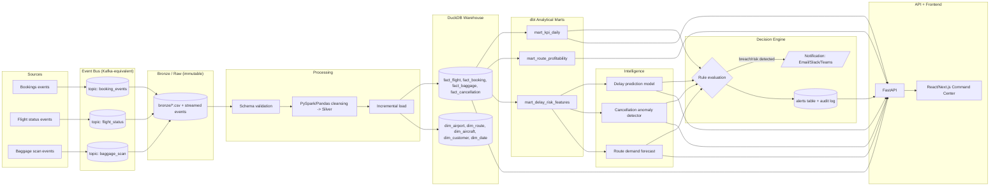
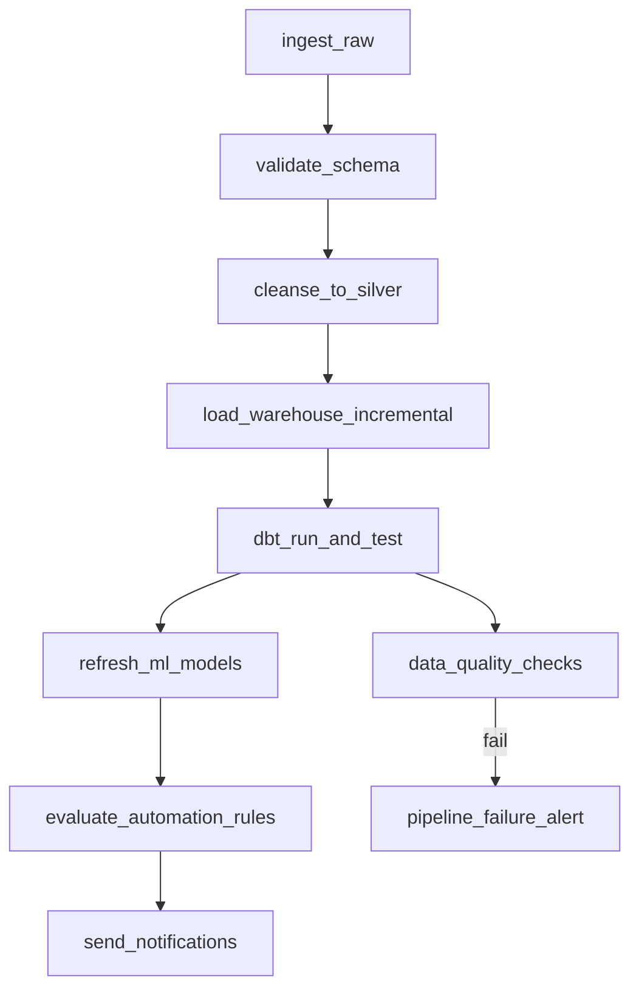

# TravelOps 360 — Architecture

## Technology mapping (spec technology -> equivalent used in this build)

| Spec asks for | We use | Why |
|---|---|---|
| Kafka | `confluent-kafka`/`aiokafka` compatible **local event-log broker** (topic/partition/offset/consumer-group semantics implemented over SQLite + append-only files) OR real Kafka via `docker-compose` (bitnami/kafka) when Docker is available | Same pub/sub + consumer-group + offset semantics as Kafka; swappable for a real broker by changing one config value |
| GCS/S3 | Local `data/bronze` (immutable, partitioned by `_batch_id`/date) | Same "raw immutable zone" pattern; swap for a boto3/gcsfs client later |
| BigQuery/Snowflake | **DuckDB** (`data/warehouse/travelops.duckdb`) | Full SQL warehouse semantics (dbt-duckdb adapter exists), zero-cost, runs anywhere |
| dbt | `dbt-duckdb` project | Real dbt: staging -> intermediate -> marts, tests, docs |
| Airflow | Real Airflow **DAG definitions** (`orchestration/dags/`) + a lightweight local runner script that executes the same DAG shape for demo without needing the Airflow webserver | DAG code is portable to a real Airflow deployment unchanged |
| FastAPI | FastAPI | Direct match |
| React/Next.js | React/Next.js frontend (or a published single-page app artifact for the live demo) | Direct match |
| Docker/GitHub Actions | Dockerfiles per service + `.github/workflows/ci.yml` | Direct match |
| Cloud deployment | Deployment docs for Render/Fly.io/AWS (free-tier friendly) | Direct match, documented step by step |

## End-to-end flow

## Orchestration (Airflow DAG shape)

