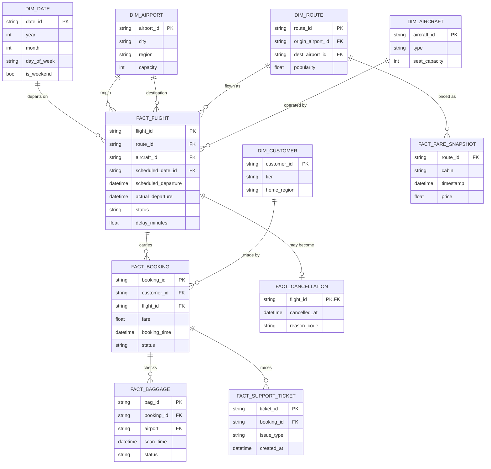

# TravelOps 360 — ERD / Star Schema

## Warehouse star schema (target of Silver -> Gold / dbt marts)

## Source -> Target mapping (Bronze -> Silver -> Gold)

| Bronze source | Silver (cleansed) | Gold / Mart |
|---|---|---|
| flights.csv | silver_flights (deduped, typed, business-key validated) | fact_flight, fact_cancellation |
| bookings.csv | silver_bookings | fact_booking |
| baggage.csv | silver_baggage | fact_baggage |
| support_tickets.csv | silver_support | fact_support_ticket |
| fares.csv | silver_fares | fact_fare_snapshot |
| airports/aircraft/routes/customers/dim_date | silver_* (SCD-1 for now) | dim_airport, dim_aircraft, dim_route, dim_customer, dim_date |

Audit columns added at Silver: `_ingested_at`, `_source_file`, `_batch_id`, `_is_valid` (schema-validation flag).
